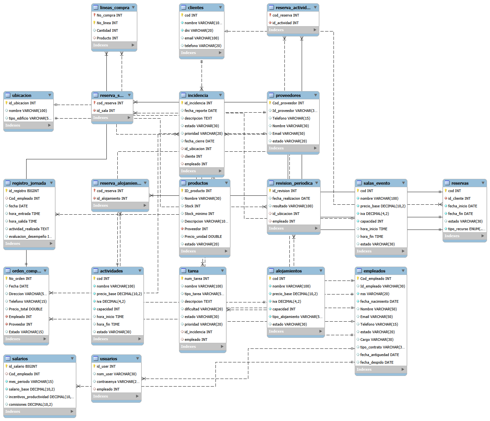

# Sistema de Gestión Hotel **Punto y Coma**


---

## Índice

1. [Descripción General](#descripcion-general)
2. [Integrantes del Grupo](#integrantes-del-grupo)
3. [Organización en GitHub](#organizacion-en-github)
4. [Tecnologías Utilizadas](#tecnologias-utilizadas)
5. [Subsistemas del Proyecto](#subsistemas-del-proyecto)
6. [Diagrama Entidad-Relación](#diagrama-entidad-relacion)
7. [Ejemplos de Código](#ejemplos-de-codigo)
8. [Estado del Proyecto](#estado-del-proyecto)

---

## Descripción General

Sistema integral para la gestión de un hotel-resort que permite administrar reservas de alojamientos y espacios, gestionar eventos, actividades para clientes, así como la gestión interna de mantenimiento y compras a proveedores. El proyecto se compone de una **aplicación Java en modo consola** con conexión a **MySQL** y una **web informativa** desarrollada con **HTML, CSS y JavaScript**.

> [!NOTE]
> Este proyecto se desarrolla bajo metodología **SCRUM** con entregas incrementales e iterativas.

> [!IMPORTANT]
> El sistema cuenta con autenticación de usuarios por roles: **Administrador**, **Encargado de Compras** y **Encargado de Reservas**.

---

## Integrantes del Grupo

| Nombre | Rol |
|--------|-----|
| **María Herrero** | Release Manager |
| **David Catalán** | QC Manager (Quality Control) |
| **Aaron García** | Developer |

---

## Organización en GitHub

Repositorio oficial: [https://github.com/mariia0313/PROYECTO_PuntoyComa.git](https://github.com/mariia0313/PROYECTO_PuntoyComa.git)

### Estructura de Ramas

| Rama | Propósito |
|------|-----------|
| `main` | Código estable de producción |
| `development` | Integración de funcionalidades terminadas |
| `feature/*` | Ramas temporales para cada User Story |

### Flujo de Trabajo

1. Los desarrolladores crean una rama `feature/nombre-feature` a partir de `development`.
2. Al finalizar, abren una **Pull Request** hacia `development`.
3. Un compañero revisa el código y realiza el **merge**, garantizando revisión cruzada.
4. Las ramas mergeadas se eliminan.

### Problemas Resueltos

> Durante el desarrollo se produjo un merge accidental en `main`. La Release Manager ejecutó un **revert** para restaurar la rama principal y posteriormente la funcionalidad se integró correctamente en `development`.

> Los conflictos entre archivos los resuelve la persona que subió el archivo, luego hace el merge y un compañero valida la PR.

---

## Tecnologías Utilizadas

| Tecnología | Versión | Propósito |
|------------|---------|-----------|
| Java SE | 21 | Lógica de negocio (CLI) |
| MySQL Community Server | 8.x | Persistencia de datos |
| HTML5 + CSS3 + JavaScript | - | Web informativa |
| Git + GitHub | - | Control de versiones |
| IntelliJ IDEA / VS Code | - | Entorno de desarrollo |
| Apache Ant / Maven | - | Automatización de builds |

## Subsistemas del Proyecto

### Gestion de Personal

**Tablas implicadas:** `empleados`, `usuarios`, `salarios`, `registro_jornada`

Gestiona la informacion de los trabajadores del hotel. La tabla `empleados` almacena datos personales, cargo y estado laboral. Cada empleado tiene un `usuario` asociado para la autenticacion en el sistema. Los `salarios` registran el sueldo base, incentivos y comisiones por periodo, mientras que `registro_jornada` controla la entrada, salida y evaluacion del desempeno diario.
> No es un subsistema indicado en el enunciado del proyecto, pero era necesario para poder llevarlo a cabo.

### Subsistema de Gestion de Reservas y ACtividades

**Tablas implicadas:** `clientes`, `alojamientos`, `actividades`, `salas_evento`, `reservas`, `reserva_alojamiento`, `reserva_actividad`, `reserva_sala`

Administra las reservas de alojamiento y espacios. Los `clientes` pueden reservar distintos tipos de recurso (`alojamientos`, `actividades` o `salas_evento`). La tabla `reservas` actua como tabla principal con un campo `tipo_recurso` (ENUM), y tres tablas puente (`reserva_alojamiento`, `reserva_actividad`, `reserva_sala`) almacenan la relacion especifica con cada recurso.

**Tablas implicadas:** `actividades`, `reserva_actividad`, `clientes`

Gestiona las actividades ludicas del hotel. La tabla `actividades` almacena el nombre, precio, capacidad, horarios y estado de cada actividad. Los clientes alojados pueden reservar actividades a traves de la tabla puente `reserva_actividad`, que vincula la reserva con la actividad concreta. Se incluye control de aforo y exportacion de registros.
> Decidimos juntar el subsistema de reservas y el de actividades dado que un integrante no iba a poder realizar el proyecto.

### Subsistema de Mantenimiento

**Tablas implicadas:** `ubicacion`, `incidencia`, `tarea`, `revision_periodica`, `clientes`, `empleados`

Coordina las incidencias reportadas por personal o clientes. Las `incidencias` se asocian a una `ubicacion` del hotel y pueden ser reportadas por `clientes` o `empleados`. A partir de cada incidencia se generan `tareas` asignadas al personal de mantenimiento. Ademas, se programan `revision_periodica` para mantenimiento preventivo de las instalaciones.

### Subsistema de Compras a Proveedores

**Tablas implicadas:** `proveedores`, `productos`, `orden_compra`, `lineas_compra`, `empleados`

Gestiona proveedores y productos de compras. Los `proveedores` suministran `productos` que tienen control de stock minimo. Las `ordenes_compra` son creadas por `empleados` y detallan los productos solicitados a traves de `lineas_compra`. El sistema permite seguimiento del estado del pedido (Pendiente, Confirmado, Enviado, etc.).

---

## Diagrama Entidad-Relacion


---

## Ejemplos de Codigo

### Conexion a Base de Datos

```java
import java.sql.Connection;
import java.sql.DriverManager;
import java.sql.SQLException;

public class ConexionBD {
    private static final String URL = "jdbc:mysql://localhost:3306/Proyecto_PuntoyComa";
    private static final String USER = "root";
    private static final String PASSWORD = "tu_contraseña";

    public static Connection getConnection() throws SQLException {
        return DriverManager.getConnection(URL, USER, PASSWORD);
    }
}
```

### Consulta de Empleados

```java
import java.sql.*;

public class EmpleadoDAO {
    public void listarEmpleados() {
        String sql = "SELECT Cod_empleado, Nombre, Cargo, estado FROM empleados";

        try (Connection conn = ConexionBD.getConnection();
             Statement stmt = conn.createStatement();
             ResultSet rs = stmt.executeQuery(sql)) {

            while (rs.next()) {
                int codigo = rs.getInt("Cod_empleado");
                String nombre = rs.getString("Nombre");
                String cargo = rs.getString("Cargo");
                String estado = rs.getString("estado");

                System.out.printf("ID: %d | Nombre: %s | Cargo: %s | Estado: %s%n",
                        codigo, nombre, cargo, estado);
            }
        } catch (SQLException e) {
            System.err.println("Error al consultar empleados: " + e.getMessage());
        }
    }
}
```

### Insercion de una Reserva

```java
import java.sql.*;

public class ReservaDAO {
    public void crearReserva(int idCliente, String fechaInicio, String fechaFin,
                              int idAlojamiento) throws SQLException {
        String sqlReserva = "INSERT INTO reservas (id_cliente, fecha_inicio, fecha_fin, " +
                          "tipo_recurso) VALUES (?, ?, ?, 'ALOJAMIENTO')";
        String sqlAlojamiento = "INSERT INTO reserva_alojamiento (cod_reserva, id_alojamiento) " +
                              "VALUES (?, ?)";

        Connection conn = null;
        try {
            conn = ConexionBD.getConnection();
            conn.setAutoCommit(false);

            try (PreparedStatement psReserva = conn.prepareStatement(sqlReserva,
                     Statement.RETURN_GENERATED_KEYS)) {
                psReserva.setInt(1, idCliente);
                psReserva.setString(2, fechaInicio);
                psReserva.setString(3, fechaFin);
                psReserva.executeUpdate();

                ResultSet rs = psReserva.getGeneratedKeys();
                if (rs.next()) {
                    int codReserva = rs.getInt(1);
                    try (PreparedStatement psAloj = conn.prepareStatement(sqlAlojamiento)) {
                        psAloj.setInt(1, codReserva);
                        psAloj.setInt(2, idAlojamiento);
                        psAloj.executeUpdate();
                    }
                }
            }
            conn.commit();
            System.out.println("Reserva creada exitosamente.");
        } catch (SQLException e) {
            if (conn != null) conn.rollback();
            throw e;
        } finally {
            if (conn != null) conn.close();
        }
    }
}
```

---

## Estado del Proyecto

> [!IMPORTANT]
> El proyecto se encuentra actualmente en **fase de desarrollo e integracion** en la rama `development`.

| Hito | Estado |
|------|--------|
| Diseño de base de datos | Completado |
| Gestión de Personal | Completado |
| Subsistema de Compras | Completado |
| Subsistema de Reservas y Actividades | En desarrollo |
| Subsistema de Mantenimiento | Pendiente |
| Web informativa | En desarrollo |
| Testing y QC | Realizado |
| Release v1.0.0 | Pendiente |

---

**Proyecto Intermodular 1º DAW - IES Font de Sant Lluís**
